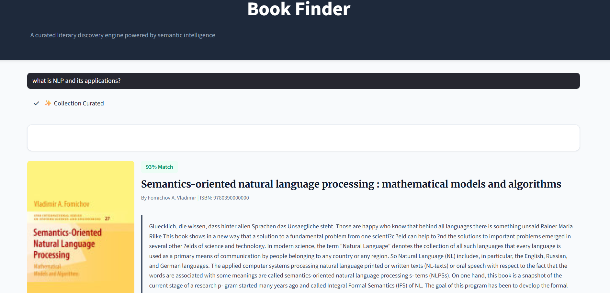

# Book Finder

A complete pipeline to ingest, transform, store, and serve book data with automated enrichment.

---

## Project Structure
- `app/`: Modular pipeline logic (`pipeline.py`, `utils.py`), core recommender logic (`recommender.py`), CLI interface (`cli.py`), web UI (`ui.py`), and FastAPI application (`main.py`).
- `data/`: SQLite database (`books.db`) and raw CSV data files.
- `notebooks/archive/`: Jupyter notebooks (archived).
- `run.py`: Single entry point for all operations.

---

## Setup & Execution

### 1. Install Dependencies
```bash
pip install -r requirements.txt
```

### 2. Recommendation UI (Local)
To start the discovery engine locally:
```bash
python run.py recommend
```

### 3. API & Backend
To start the FastAPI server (required for syncing and administrative tasks):
```bash
python run.py serve
```

---

## Deployment

### Streamlit Community Cloud
This application is designed for easy deployment to Streamlit's cloud:

1.  **Push to GitHub**: Ensure all code and the `data/` directory (containing `books.db`, `books_index.faiss`, and `books_metadata.pkl`) are pushed to your repository.
2.  **Connect to Streamlit**: Sign in to [share.streamlit.io](https://share.streamlit.io) and link your GitHub repository.
3.  **App Settings**: Set the main file path to `app/ui.py`.
4.  **Secrets**: In the Streamlit dashboard, go to **Settings > Secrets** and add your API keys:
    ```toml
    GROQ_API_KEY = "your_key_here"
    # or
    OPENAI_API_KEY = "your_key_here"
    ```

---

## CLI Commands
The `run.py` script serves as the primary interface for managing the system:

- **Recommend (UI)**: `python run.py recommend` (Starts the Streamlit discovery engine)
- **Serve (API)**: `python run.py serve` (Starts the FastAPI backend)
- **Setup**: `python run.py setup` (Runs the full ingestion and data enrichment pipeline)
- **Index**: `python run.py index` (Rebuilds the FAISS semantic search index)
- **Search**: `python run.py search "query"` (Command-line search utility)
- **Sync**: `python run.py sync <isbn>` (Manually ingest/update a book via its ISBN)
- **Stats**: `python run.py stats` (View database and pipeline performance metrics)

---

## Data Statistics
The following insights are derived from the current state of the book database:

### General Overview
- **Initial Records**: 36,358 (Raw dataset)
- **Total Unique Books**: 10,922 (After deduplication and enrichment)
- **Unique Publishers**: 2,126
- **Publication Year Range**: 1879 — 2025 (Average: 2004)

### Description Metrics
- **Average Description Length**: ~831 characters
- **Longest Description**: 6,111 characters
- **Shortest Description**: 7 characters
- **Description Coverage**: 100%

### Top Authors (by count)
| Author | Books in DB |
| :--- | :--- |
| Tagore, Rabindranath | 16 |
| Bourdieu, Pierre | 14 |
| Stallings, William | 13 |
| Singh, K. S. | 13 |
| Lessing, Doris | 13 |

---

## Data Schema
| Column | Type | Description |
| :--- | :--- | :--- |
| `title` | TEXT | The title of the book. |
| `author` | TEXT | The author or editor. |
| `year` | SMALLINT | Publication year. |
| `edition` | TEXT | Edition or volume information. |
| `publisher` | TEXT | Publisher and place of publication. |
| `isbn` | TEXT (UNIQUE) | Cleaned ISBN-10 or ISBN-13. |
| `description`| TEXT | Enriched and cleaned book description. |

---

## System Architecture & Flow

The system operates in three main stages: **Ingest**, **Index**, and **Serve**.

1.  **Ingestion & Enlightenment**:
    -   Raw book data is read from CSV files.
    -   The system attempts to fetch enriched metadata (Abstracts, Covers, Keywords) from multiple external sources:
        -   **Google Books API**
        -   **Open Library API**
        -   **OpenAlex** (Abstracts)
    -   Data is cleaned (ftfy), normalized, and stored in a SQLite database (`books.db`).

2.  **Semantic Indexing**:
    -   We use `sentence-transformers` (Model: `all-MiniLM-L6-v2`) to generate vector embeddings for every book description.
    -   These embeddings are stored in a **FAISS** index (`books_index.faiss`) for ultra-fast similarity search.

3.  **Discovery Engine (Recommendation)**:
    -   User enters a natural language query (e.g., "philosophical sci-fi about memory").
    -   The engine converts the query into a vector and finds the nearest neighbors in the FAISS index.
    -   Results are reranked (see below) and displayed in a modern Streamlit UI.

---

## Recommendation System Features

The core of the "Book Finder" is a hybrid semantic search engine designed to find books based on *meaning* rather than just keywords.

### 1. Vector Search (Retrieval)
-   **Technology**: FAISS (Facebook AI Similarity Search) + Sentence Transformers.
-   **Process**: Converts the user's search query into a high-dimensional vector and retrieves the top 20 semantically similar books from the database. This allows it to understand concepts like "coming of age" or "dystopian society" even if those exact words aren't in the book description.

### 2. Intelligent Scoring (Cosine Similarity)
-   **Match Score**: Instead of arbitrary ranking, we calculate the exact **Cosine Similarity** (0-100%) between your query and the book's content.
-   This score represents how mathematically close the book's themes are to your request.

### 3. LLM Reranking & Explanation (Optional)
-   If an API Key (Gemini, Groq, or OpenAI) is provided, the top results are sent to a Large Language Model (e.g., **Gemini 1.5 Flash**).
-   **Reranking**: The LLM analyzes the specific nuances of your query to re-order the books based on relevance.
-   **Explanation**: The LLM writes a personalized "Why this book?" blurb, explaining exactly why it fits your search criteria.

### 4. Rich Visuals
-   **Cover Art**: Automatically fetches high-quality cover images from Google Books and Open Library.
-   **Fallback**: If an ISBN is missing or invalid, the system intelligently searches by Title + Author to ensure a cover is found.

---

## UI Demo Images

<p align="center">
  
  <br>
  <em>Image 1: Prompting query from the user </em>
</p>

<p align="center">
  
  <br>
  <em>Image 2: User being updated after entering the query </em>
</p>

<p align="center">
  
  <br>
  <em>Image 3: Showing the recommendations </em>
</p>

<p align="center">
  
  <br>
  <em>Image 4: Another query and its results </em>
</p>
